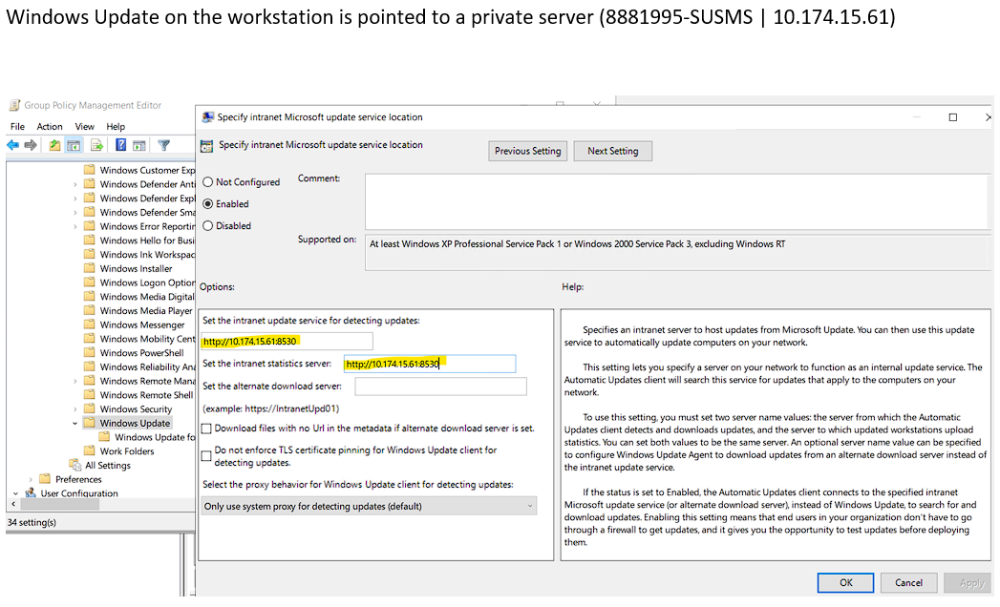
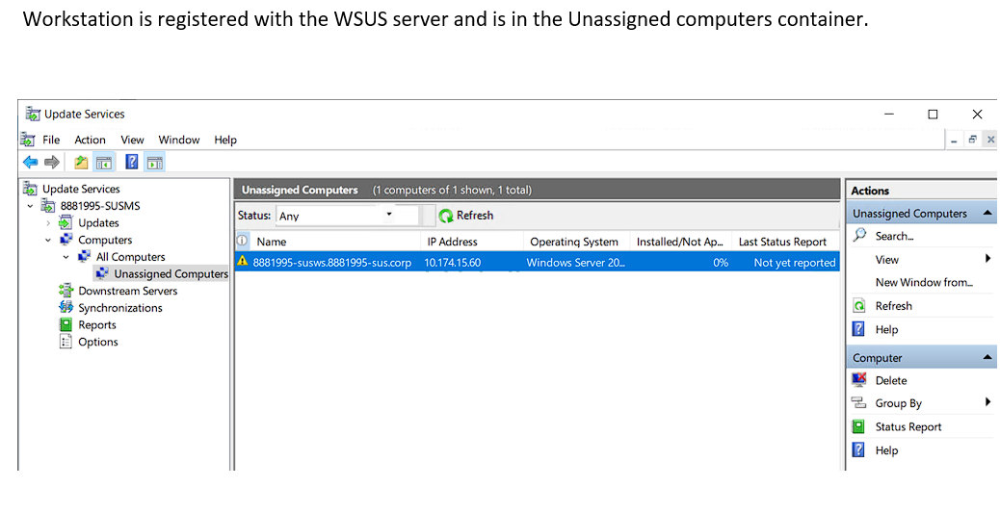
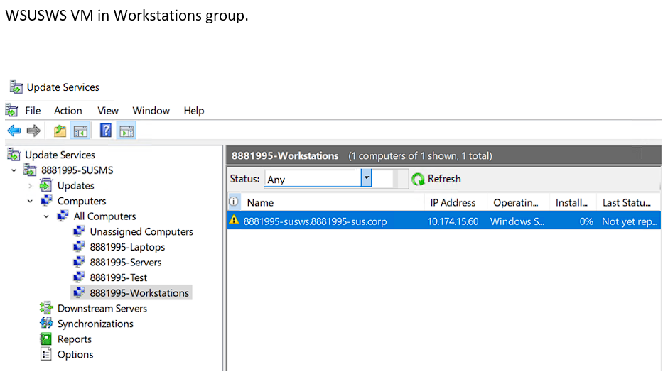
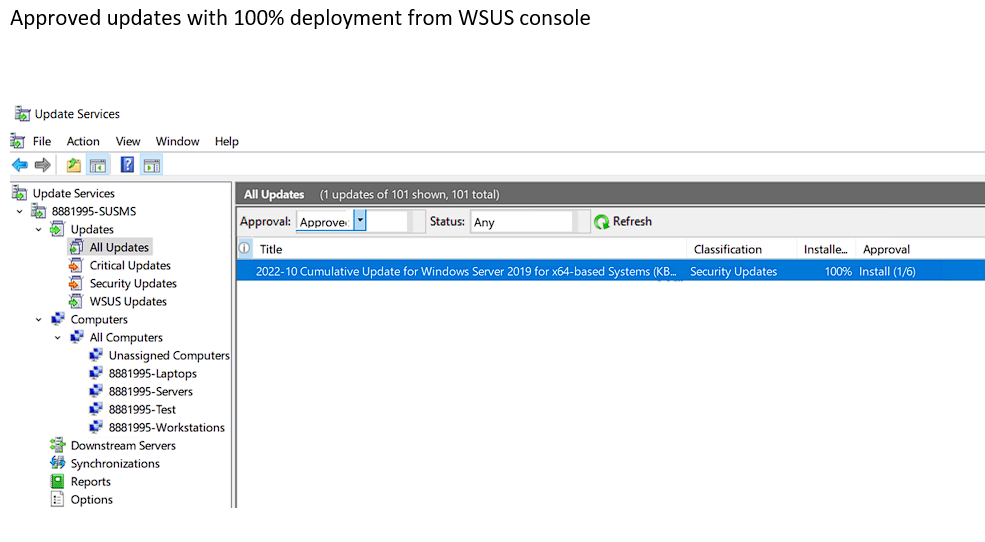
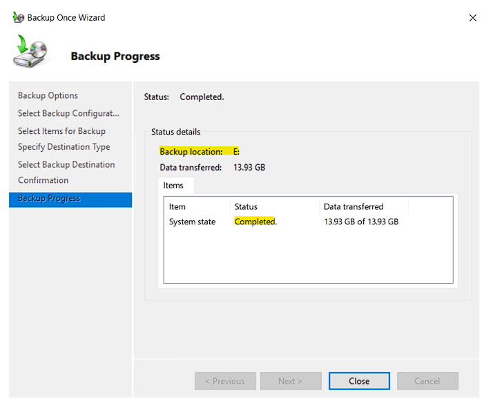
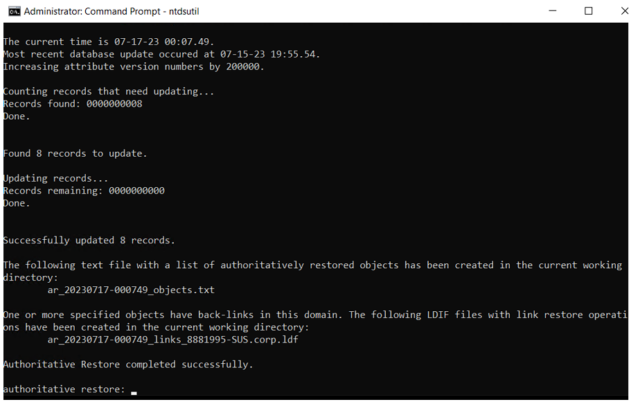

# 🖥️ Windows Server 2019 – WSUS Configuration & Active Directory Backup Lab

This project demonstrates **Windows Server Update Services (WSUS) configuration** and **Active Directory (AD) backup and authoritative restore** on Windows Server 2019.  

---

## 📌 Lab Objectives
- Install and configure **Windows Server Update Services (WSUS)**.  
- Configure workstations to receive updates from WSUS using **Group Policy Objects (GPOs)**.  
- Organize computers into WSUS **computer groups** for staged update deployment.  
- Approve and deploy updates to servers and workstations.  
- Perform **Active Directory backup** using Windows Backup.  
- Execute an **authoritative restore** to recover deleted OUs, users, and groups.

---

## 🏗️ Lab Setup
- **Virtualization:** VMware vSphere  
- **OS:** Windows Server 2019  
- **Servers & Roles:**
  - `8881995-SUSDC` → Domain Controller (10.174.15.58)
  - `8881995-SUSMS` → WSUS Server (10.174.15.61)
  - `8881995-SUSWS` → Workstation (10.174.15.60)

---

## 🔑 Lab Tasks

### 1️⃣ WSUS Installation & Configuration
- Installed the **WSUS role** on the WSUS server (`8881995-SUSMS`).  
- Configured initial WSUS settings.  
- Installed **IIS**, which is required for hosting WSUS content.  

**Reflection:** IIS is crucial for web hosting but requires security hardening to prevent cyber attacks.  

---

### 2️⃣ Configure Workstation to Receive Updates
- Created **AD OU**: `8881995_Corp\Workstations`.  
- Created and linked **GPO** to point WSUS clients to the WSUS server (`http://10.174.15.61:8530`).  
- Moved workstation VM to the Workstations OU.  

**Reflection:** An in-house WSUS server improves update control, network efficiency, and security.  

---

### 3️⃣ Configure Computer Groups in WSUS
- Created WSUS computer groups:
  - `8881995-Workstations`
  - `8881995-Servers`
  - `8881995-Laptops`
  - `8881995-Test`  
- Assigned workstation VM to the Workstations group.  
- Monitored patch status.  

**Reflection:** Computer groups allow staged deployments, customized policies, and reduce downtime.  

---

### 4️⃣ Approve & Deploy Updates
- Approved **Windows Server 2019 Cumulative Updates** via WSUS.  
- Monitored deployment success across the network.  

**Reflection:** WSUS ensures stability and security by controlling update deployment in a controlled manner.  

---

### 5️⃣ Active Directory Backup & Authoritative Restore
- Added a **60GB disk** to the Domain Controller and formatted it as `E:`.  
- Created a test OU `Test-Restore` with users and groups.  
- Installed **Windows Backup**, performed a **system state backup**, and deleted the OU.  
- Rebooted into **Directory Services Restore Mode (DSRM)**.  
- Used `wbadmin` and `ntdsutil` to perform an **authoritative restore** of the deleted OU and subordinate objects.  

**Reflection:** This lab reinforced the importance of backups, recovery strategies, and AD disaster recovery planning.  

---

## 📝 Skills Gained
- Windows Server 2019 administration  
- WSUS installation, configuration, and patch management  
- Group Policy Objects (GPO) and OU management  
- Active Directory backup and authoritative restore  
- System recovery and disaster management  

---

## 📂 Repository Structure
